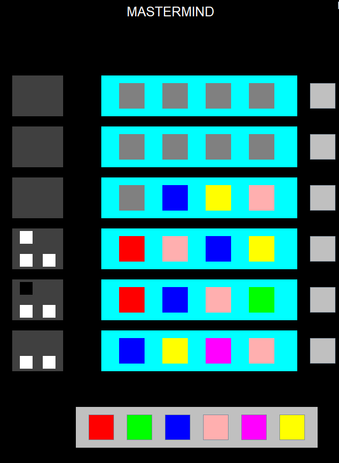

# Mastermind
Java full implementation of popular in 90s game - Mastermind, made for singleplayer experience.

## Rules 
1. There is a hidden randomly generated pattern of 4 out of 6 marker colors. Each color can occur only once.
2. Player has 5 rounds to guess the pattern. In each round player makes a guess by placing four markers in current row.
3. When player submits guess, then system generates response in form of black and white result markers on the left-hand panels. Black marker means that one of the colors from our guess is placed exactly in the place where it should be. White marker means that one of our colors matches the hidden pattern color, but is placed in the wrong box.

***

## Compilation 
First, you need to have java installed on your machine.

Best way to compile the project is by using vscode extensions:  
* Project Manager for Java

***
## Project Structure
**GameElements**  
->`Controller`: Main class which handles initialization of Ui elements and has some logic methods  
->`Main`: Bootstrapper for poject, start class  
->`MouseEvents`: Custom wrapper on AWT MouseListeners  
-> **UIelements**  
---->**Classes**  
------->`CheckButton`: Check current pattern and start display results event    
------->`Grabber`: Element that grabs floating markers in currently active rows  
------->`Marker`: Markers of each color used to create patterns and results  
------->`Spawner`: Elements that spawn floating marker on click  
---->**Interfaces**  
------->`ICheckButton`   
------->`IGrabber`   
------->`IMarker`   
------->`ISpawner`  
**Global**  
->`Factory`: Factory class with instantiations of some classes  
->`Logger`: Simple static logger   
***
## Game

